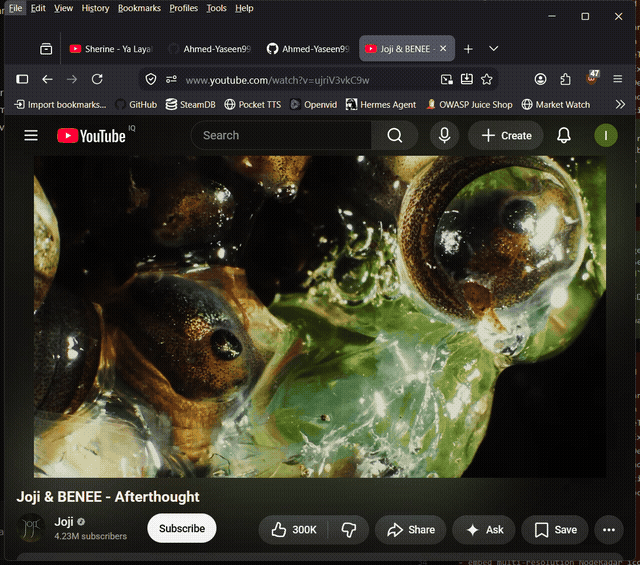

# youtube-media-control



Deterministic keyboard control of YouTube and other media on Windows, built for AI agents. One command, one action, zero ML decisions. Made to be called from a script, a macro pad, or an agent loop.

## Why this exists

Media keys exist on every keyboard, and YouTube shortcuts exist on every tab. Getting an *automation* to press them reliably is the hard part:

- Global actions (play/pause, next, prev, volume) go through the **Windows system media session**, the same path as hardware media buttons. They work no matter which app is playing, no foreground required, and focus stealing can't block them.
- Page shortcuts (mute, fullscreen, seek) need the browser window focused. This script forces focus with the full Win32 recipe (AttachThreadInput, topmost SetWindowPos, simulated ALT input, SetForegroundWindow, then verify) and **refuses to claim success it can't verify**. If focus fails, the key is not sent and exit code 3 tells you why.

It finds the browser window by process (EnumWindows + QueryFullProcessImageName), not by guessing titles. It never writes code, never browses, never asks anything.

## Quick start

```bash
python youtube_media_control.py playpause   # any browser, any app
python youtube_media_control.py mute        # focuses the browser first, then m
python youtube_media_control.py loop        # Firefox: toggles video.loop via BiDi
python youtube_media_control.py next --browser chrome
```

## Actions

| Action | Key | Focus needed? | Any browser? |
|---|---|---|---|
| `playpause` / `pause` | Media play/pause | No | Yes (any app even) |
| `next` / `prev` / `stop` | Media next/prev/stop | No | Yes |
| `volumeup` / `volumedown` | Media volume | No | Yes |
| `mute` | `m` | Yes | Chromium + Firefox |
| `fullscreen` | `f` | Yes | Chromium + Firefox |
| `rewind10` | `j` | Yes | Chromium + Firefox |
| `forward10` | `l` | Yes | Chromium + Firefox |
| `loop` | JS via BiDi | No | Firefox only |

`--browser` accepts `firefox`, `chrome`, `edge`, `brave`, `opera`, `vivaldi`, `chromium` (try `ff` / `msedge` / `google-chrome` as aliases). Default: first supported browser found.

## Built for agents

Deterministic output, parseable exit codes, no hidden state:

```
WINDOW: "Rick Astley - Never Gonna Give You Up (Official Music Video)"  (stderr)
ACTION: mute
KEY: m
FOCUS: OK
OK
```

| Exit code | Meaning |
|---|---|
| `0` | Action sent |
| `2` | No supported browser running, or BiDi unavailable (loop) |
| `3` | Focus failed: key **not** sent (focused actions only) |
| `4` | Unknown action |

An agent (Hermes, opencode, whatever) can run this over SSH, parse stdout for `ACTION`/`RESULT`/`OK`, and trust that `FOCUS: FAIL` means nothing was pressed.

## Requirements

- Windows (7–11; uses Win32 APIs directly via ctypes)
- A supported browser running; Firefox with the remote agent port `9222` enabled for `loop`
- `pyautogui` for focused actions, `websocket-client` for `loop`

## Design notes

- Global-key actions deliberately avoid focus games. Windows routes media keys to the active media session, so the script never touches window state for them.
- The focus recipe is in one function with verification loops. If Windows changes its focus rules, there's exactly one place to fix.
- Every path prints `ACTION:` / `RESULT:` / `OK` or an error line, so output is stable for agents to parse.
- `loop` uses Firefox BiDi because that's the only standardized remote protocol here; Chromium equivalents need a debug port, which is a bigger ask than a convenience toggle is worth.

## License

MIT. See [LICENSE](https://github.com/Ahmed-Yaseen99/youtube-media-control/blob/main/LICENSE).
